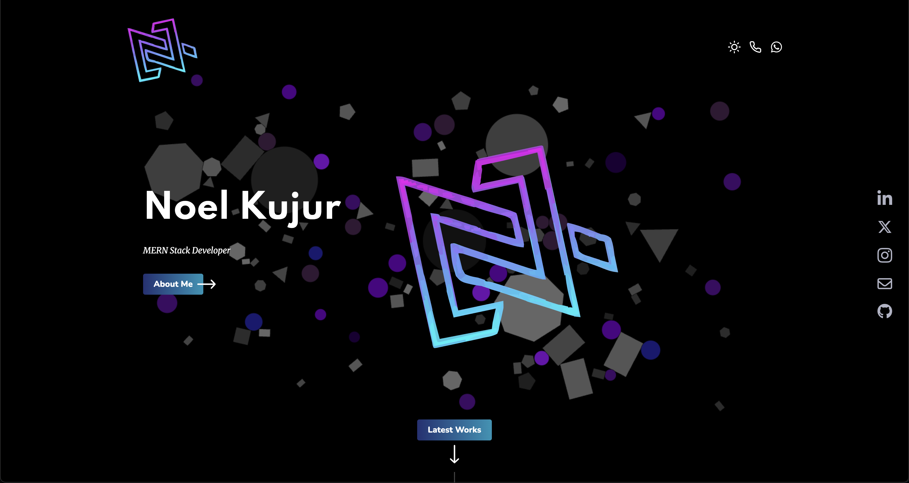
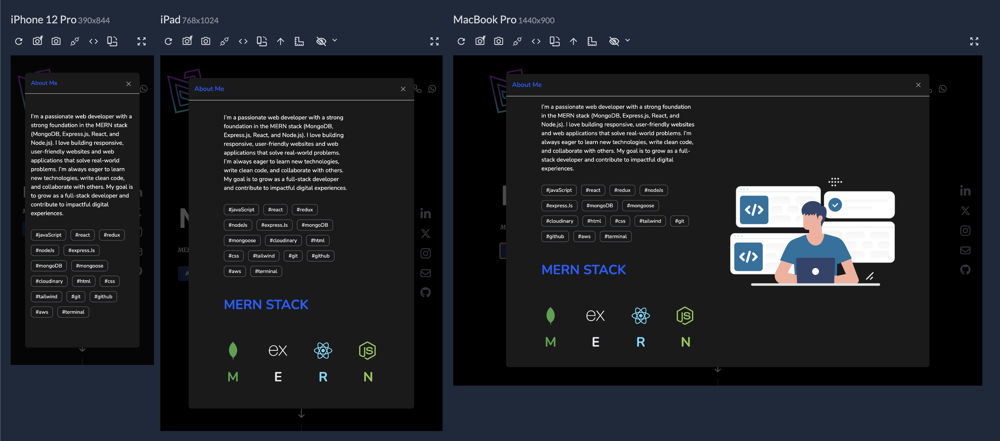
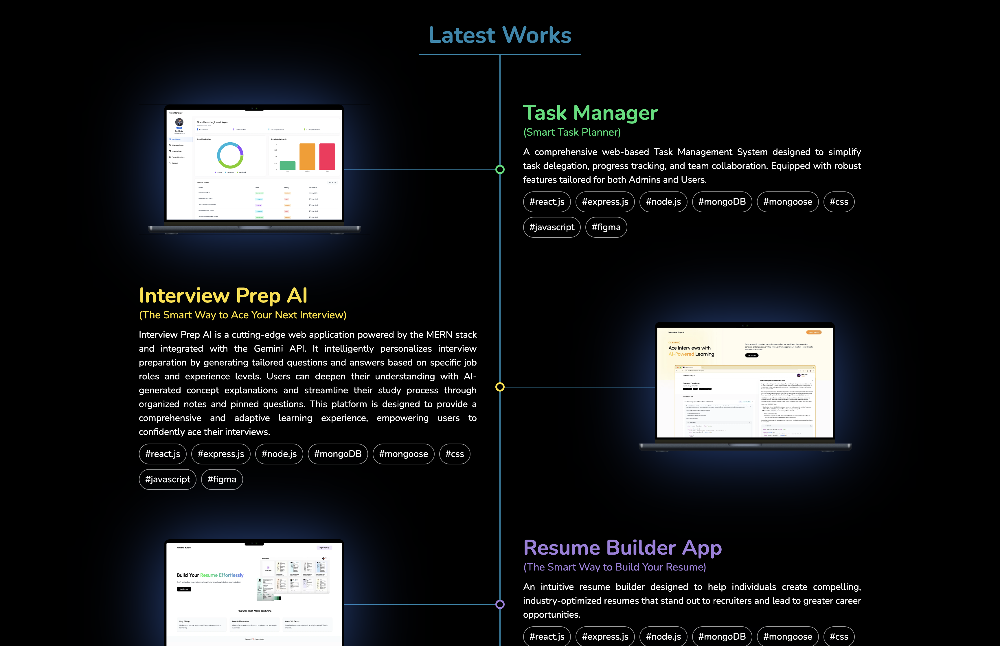

# 🚀 Noel Kujur - Developer Portfolio

Welcome to my personal portfolio website! This site showcases my work, technical skills, projects, and contact information. Built with modern web technologies, it reflects my passion for clean design, interactive UI, and full-stack development.

---

📸 Screenshots

- Header



- About us



- Latest Work




---

## ✨ Features

- 🎨 Clean, responsive design
- 💼 Project showcase with GitHub/live demo links
- 📜 Downloadable resume
- 💬 Contact form (via EmailJS/Formspree)
- 🌙 Dark/Light mode toggle (optional)
- ⚡ Smooth transitions and animations

---

## 🔧 Tech Stack

| Frontend     | Backend (optional) | Styling         | Tools & Services      |
|--------------|--------------------|------------------|------------------------|
| React.js     | Node.js/Express.js | Tailwind CSS     | Git, Vite, render     |
| HTML5        |                    | Framer Motion    | VS Code, GitHub Pages |
| JavaScript   |                    | CSS Animations   | EmailJS/Formspree     |

---

## 📂 Folder Structure

```bash
my-portfolio/
├── public/
│ └── assets/ # Static images and icons
├── src/
│ ├── components/ # Reusable UI components
│ ├── pages/ # Home, Projects, About, Contact
│ ├── styles/ # Tailwind config or custom CSS
│ ├── App.jsx
│ └── main.jsx
├── .gitignore
├── package.json
├── README.md
└── vite.config.js
```

---

## 🚀 Getting Started

Follow these steps to run this project locally:

```bash
# Clone the repository
git clone https://github.com/Lovenoelkujur/portfolio.git

# Navigate to the project folder
cd portfolio

# Install dependencies
npm install

# Start the development server
npm run dev
```

🌐 Live Demo
Check out the live portfolio: https://yourusername.github.io/portfolio

🙏 Acknowledgements

- Inspired by modern developer portfolio designs

- Icons from Font Awesome

- Deployed via Netlify / Vercel / Render

📌 License

This project is open source and available under the MIT License.